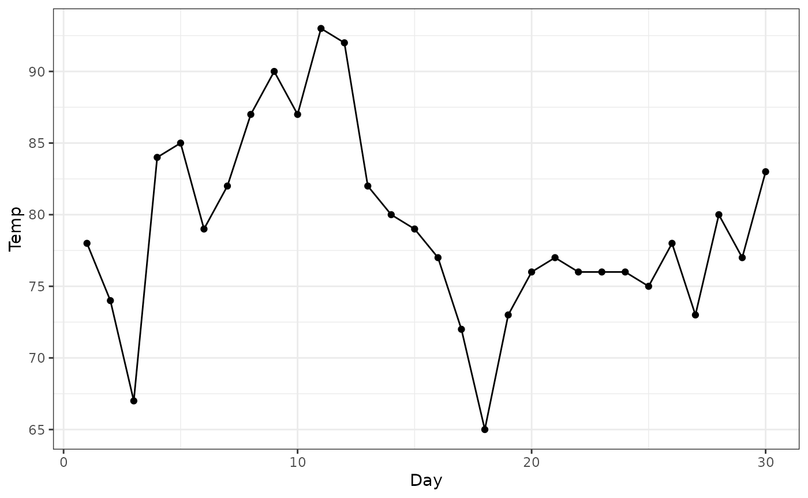
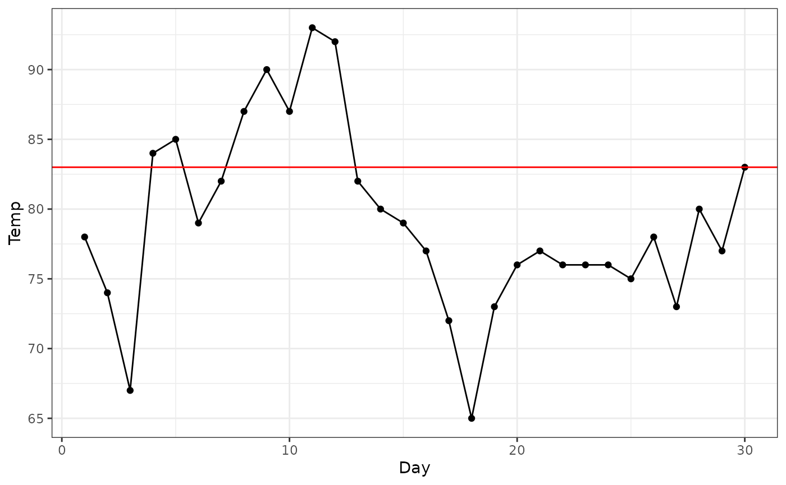
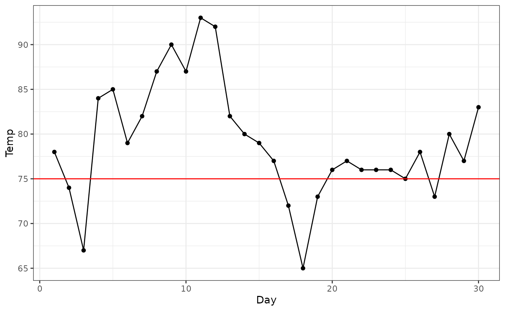
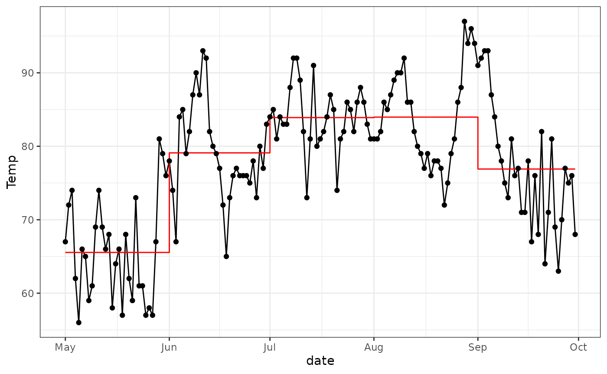

# Get started

The `nseq` package helps to count the number of sequences of values in a
vector that meets conditions of length and magnitude.

As an example, let’s use the `airquality` dataset. It contains daily air
quality measurements in New York, from May to September 1973.

``` r
library(nseq)
data("airquality")

head(airquality)
#>   Ozone Solar.R Wind Temp Month Day
#> 1    41     190  7.4   67     5   1
#> 2    36     118  8.0   72     5   2
#> 3    12     149 12.6   74     5   3
#> 4    18     313 11.5   62     5   4
#> 5    NA      NA 14.3   56     5   5
#> 6    28      NA 14.9   66     5   6
```

## Examples

First, let’s consider the temperature measurements taken in June.

``` r
june_data <- subset(airquality, Month == 6)
```

``` r
library(ggplot2)

ggplot(june_data, aes(x = Day, y = Temp)) +
  geom_line() +
  geom_point() +
  theme_bw()
```



> How many times we had **three days or more** in a row, with
> temperatures **above** 83F?

To answer this question, first look at the plot.

``` r
ggplot(june_data, aes(x = Day, y = Temp)) +
  geom_line() +
  geom_point() +
  geom_hline(yintercept = 83, color = "red") +
  theme_bw()
```



There are two sequences of days with temperatures above 83F. One with
two days, and one with 5 days. This last sequence meets the condition of
“three days or more”.

Now, let’s use the `nseq` package to compute this for us.

``` r
trle_cond(june_data$Temp, a_op = "gte", a = 3, b_op = "gte", b = 83)
#> [1] 1
```

> How many times we had **two days or more** in sequence with
> temperatures **below** 75F?

``` r
ggplot(june_data, aes(x = Day, y = Temp)) +
  geom_line() +
  geom_point() +
  geom_hline(yintercept = 75, color = "red") +
  theme_bw()
```



``` r
trle_cond(june_data$Temp, a_op = "gte", a = 2, b_op = "lte", b = 75)
#> [1] 2
```

## Grouping

You can use the `nseq` functions inside
[`?dplyr::summarise`](https://dplyr.tidyverse.org/reference/summarise.html)
to compute counts for groups.

> For each month, how many sequences of three days or more presented
> temperatures above the month’s average.

``` r
library(dplyr)

airquality |>
  summarise(
    avg = mean(Temp, na.rm = TRUE),
    count_3 = trle_cond(Temp, a_op = "gte", a = 3, b_op = "gte", b = avg), 
    .by = Month
  )
#>   Month      avg count_3
#> 1     5 65.54839       3
#> 2     6 79.10000       1
#> 3     7 83.90323       3
#> 4     8 83.96774       2
#> 5     9 76.90000       1
```

``` r
month_avg <- airquality |>
  summarise(
    avg = mean(Temp, na.rm = TRUE),
    .by = Month
  )

airquality |>
  left_join(month_avg, by = "Month") |>
  mutate(date = as.Date(paste0(1973,"-",Month,"-",Day))) |> 
  ggplot(aes(x = date)) +
    geom_line(aes(y = Temp)) +
    geom_step(aes(y = avg), color = "red") +
    geom_point(aes(y = Temp)) +
    theme_bw()
```


